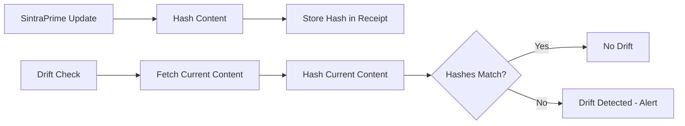

# Notion Adapter

The Notion adapter provides governed access to Notion workspaces for page management, database operations, and template management. It includes a unique **drift gate** that detects unauthorized changes to Notion content.

## Configuration

```bash title=".env"
NOTION_API_KEY=secret_your-notion-integration-token
NOTION_DRIFT_GATE=true
```

## Operations

| Operation | Description |
|:---|:---|
| `page.create` | Create a new Notion page |
| `page.update` | Update an existing page |
| `page.read` | Read page content |
| `database.query` | Query a Notion database |
| `database.create` | Create a database entry |
| `template.apply` | Apply a Notion template |
| `drift.check` | Check for unauthorized content changes |

## Drift Gate

The Notion drift gate monitors Notion pages for changes that were not made through SintraPrime:



When drift is detected, SentinelGuard is notified and a drift receipt is generated with the before/after content hashes.

## Template Management

SintraPrime includes Notion templates in the `notion-templates/` directory for common trust administration documents:

```bash
notion-templates/
├── trust-report.json
├── evidence-summary.json
├── compliance-checklist.json
└── meeting-notes.json
```

:::tip Notion Integration
The Notion adapter works best when paired with the Howard Trust Navigator for trust documentation and the Evidence Systems for evidence cataloging.
:::

## Next Steps

- [Slack Adapter](./slack) — Team communication
- [Adapters Overview](./overview) — All available adapters
