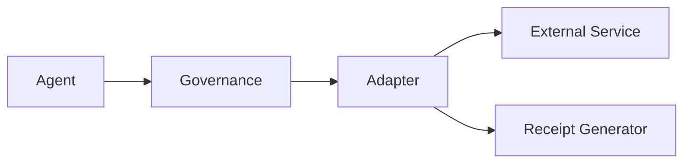

# Adapters Overview

Adapters are SintraPrime's governed interface to external services. Every adapter wraps an external API or system with governance enforcement, receipt generation, and audit logging. No agent can access an external service directly — all access flows through adapters.

## Adapter Architecture



## Available Adapters

| Adapter | Service | Key Operations | Status |
|:---|:---|:---|:---|
| [**Gmail**](./gmail) | Google Gmail | Send, receive, ingest, parse | Production |
| [**Notion**](./notion) | Notion API | Pages, databases, drift detection | Production |
| [**Slack**](./slack) | Slack API | Messages, channels, webhooks | Production |
| [**Shell**](./shell) | Local system | Command execution, sandboxed | Production |
| [**Browser**](./browser) | Playwright | Web automation, scraping, screenshots | Production |
| [**SMS**](./sms) | SMS providers | Send, receive, notifications | Beta |
| [**Voice**](./voice-transcription) | ElevenLabs | Voice synthesis, transcription | Beta |

## Adapter Interface

Every adapter implements a standard interface:

```typescript
interface Adapter {
  id: string;
  name: string;
  version: string;

  // Execute an action through governance
  execute(action: AdapterAction): Promise<AdapterResult>;

  // Check if the adapter is available
  healthCheck(): Promise<HealthStatus>;

  // Get adapter capabilities
  getCapabilities(): AdapterCapability[];
}

interface AdapterAction {
  type: string;           // e.g., "send", "read", "capture"
  params: Record<string, unknown>;
  governance: {
    mode: GovernanceMode;
    receipt_required: boolean;
    approval_id?: string;
  };
}

interface AdapterResult {
  success: boolean;
  data: unknown;
  receipt_id: string;
  cost_usd: number;
  duration_ms: number;
}
```

## Receipt-Backed Operations

Every adapter operation generates a receipt containing:

- **Operation details** — What was done, with what parameters
- **Governance context** — Mode, policy gates checked, approval status
- **Result summary** — Success/failure, output summary
- **Cost tracking** — API costs incurred
- **Timing** — Duration and timestamps

## Governance Integration

Adapters enforce governance at the operation level:

1. **Pre-execution** — Check mode, policy gates, spending limits
2. **Execution** — Perform the operation with error handling
3. **Post-execution** — Generate receipt, update spending counters
4. **Monitoring** — SentinelGuard receives operation events

:::info Adding Custom Adapters
SintraPrime's adapter system is extensible. Custom adapters can be created by implementing the `Adapter` interface and registering them in the adapter registry. See the [Contributing Guide](../contributing/guide) for details.
:::

## Next Steps

- [Gmail Adapter](./gmail) — Email operations
- [Browser Operator](./browser) — Web automation
- [Shell Adapter](./shell) — Command execution
