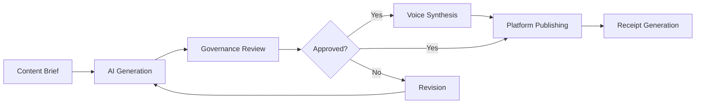

# Content Production Agent

The **Content Production Agent** (CPA) handles all content creation workflows within SintraPrime. It integrates with AI providers for content generation, ElevenLabs for voice synthesis, and multi-platform publishing channels for distribution — all under governance with full receipt trails.

## Capabilities

| Capability | Integration | Description |
|:---|:---|:---|
| **Text Generation** | ClawdBot, OpenAI, Kimi | AI-powered content writing |
| **Voice Synthesis** | ElevenLabs | Text-to-speech with mythic voice system |
| **Image Generation** | AI providers | Visual content creation |
| **Multi-Platform Publishing** | ClawdBot gateway | Publish to Telegram, Discord, Facebook, Instagram, TikTok, WhatsApp |
| **Campaign Management** | Meta Ads, Shopify | Marketing campaign execution |

## Content Pipeline



## Voice System

The CPA integrates with ElevenLabs for voice synthesis, featuring a **9-character mythic voice system** where each voice persona has distinct characteristics:

```typescript
interface VoiceCharacter {
  id: string;
  name: string;
  voice_id: string;       // ElevenLabs voice ID
  personality: string;
  use_case: string;
}
```

## Usage

```bash
# Generate a blog post
npx sintraprime agent run \
  --agent content-production-agent \
  --task "Write a blog post about AI governance best practices"

# Generate and publish to multiple platforms
npx sintraprime agent run \
  --agent content-production-agent \
  --task "Create a product announcement for the new trust monitoring feature" \
  --publish telegram,discord,facebook

# Generate voice content
npx sintraprime agent run \
  --agent content-production-agent \
  --task "Create a voice narration for the weekly trust report" \
  --voice mythic-narrator
```

## Content Governance

All content produced by the CPA is subject to governance:

- **Content review gates** — AI-generated content is reviewed before publishing
- **Brand compliance** — Content is checked against brand guidelines
- **Platform compliance** — Content is validated against platform-specific rules
- **Spending controls** — AI generation and voice synthesis costs are tracked
- **Receipt generation** — Every content operation generates a receipt

:::info Content Receipts
Content receipts include the full content hash, generation parameters, AI model used, and publishing destinations. This creates a complete audit trail for all content operations.
:::

## Next Steps

- [Multi-Platform Bots](../bots/overview) — Publishing channels for content
- [Voice & Transcription](../adapters/voice-transcription) — ElevenLabs integration details
- [Workflow Runner](../core-concepts/workflow-runner) — Automate content workflows
