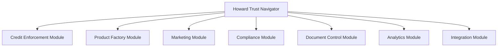

# Howard Trust Navigator

The **Howard Trust Navigator** is SintraPrime's most specialized agent, purpose-built for trust administration workflows. It comprises seven integrated modules that handle everything from credit enforcement to marketing, all operating under strict governance with court-ready evidence generation.

## Architecture

The Howard Trust Navigator is organized into seven modules:



## Modules

### 1. Credit Enforcement Module

Monitors and enforces credit-related obligations within trust administration:

- **Credit monitoring** — Real-time tracking of credit events and changes
- **Severity classification** — Automated classification of credit events by severity
- **Escalation workflows** — Automatic escalation based on severity thresholds
- **Evidence collection** — Automated evidence gathering for credit disputes

```json title="config/monitoring-policy.v1.json (excerpt)"
{
  "credit_monitoring": {
    "check_interval": "6h",
    "severity_thresholds": {
      "critical": {"score_drop": 50, "new_accounts": 3},
      "high": {"score_drop": 25, "new_accounts": 2},
      "medium": {"score_drop": 10, "new_accounts": 1}
    },
    "auto_escalate": ["critical", "high"]
  }
}
```

### 2. Product Factory Module

Manages the creation and lifecycle of trust-related products:

- **Product definition** — Structured product creation with compliance checks
- **Pricing management** — Governed pricing with audit trails
- **Shopify integration** — Automated product publishing to Shopify
- **Inventory tracking** — Real-time inventory management with receipts

### 3. Marketing Module

Handles marketing operations within governance constraints:

- **Campaign management** — Create and manage marketing campaigns
- **Meta/Facebook Ads** — Governed ad creation and budget management
- **Content generation** — AI-powered content creation with approval workflows
- **Multi-platform publishing** — Coordinated publishing across platforms

### 4. Compliance Module

Ensures all trust operations meet regulatory requirements:

- **Regulatory monitoring** — Track changes in relevant regulations
- **Compliance checks** — Automated compliance verification for operations
- **Audit preparation** — Generate compliance reports and documentation
- **Policy enforcement** — Enforce trust-specific policies

### 5. Document Control Module

Manages trust documentation with evidence-grade controls:

- **Document generation** — Automated creation of trust documents
- **Version control** — Immutable document versioning with receipts
- **Binder assembly** — Court-ready document compilation
- **Chain of custody** — Complete document handling audit trail

### 6. Analytics Module

Provides insights into trust operations:

- **Performance metrics** — Track trust performance indicators
- **Risk assessment** — Automated risk scoring and reporting
- **Trend analysis** — Historical trend identification
- **Dashboard generation** — Visual analytics for trust administrators

### 7. Integration Module

Connects the Howard Trust Navigator with external systems:

- **Gmail integration** — Trust-related email management
- **Notion integration** — Knowledge base and documentation
- **Make.com workflows** — External automation triggers
- **Evidence systems** — Direct integration with evidence lifecycle

## Usage

```bash
# Assign a task to the Howard Trust Navigator
npx sintraprime agent run \
  --agent howard-trust-navigator \
  --task "Run credit monitoring check and generate report"

# Use a specific module
npx sintraprime agent run \
  --agent howard-trust-navigator \
  --module credit-enforcement \
  --task "Check for new credit inquiries in the last 30 days"
```

## Governance

The Howard Trust Navigator operates under **strict governance**, meaning:

- All operations require explicit policy gate approval
- Financial operations always require human approval
- Every action generates a court-ready receipt
- SentinelGuard monitors all HTN activity in real-time

:::warning Trust Operations
Trust administration operations are legally sensitive. The Howard Trust Navigator is designed to produce evidence that meets court admissibility standards. Always verify that governance settings are appropriate for your jurisdiction.
:::

## Next Steps

- [SentinelGuard](./sentinel-guard) — How HTN operations are monitored
- [Evidence Lifecycle](../evidence-systems/lifecycle) — How HTN feeds evidence systems
- [Narrative Generator](../evidence-systems/narrative-generator) — Court-ready document compilation
