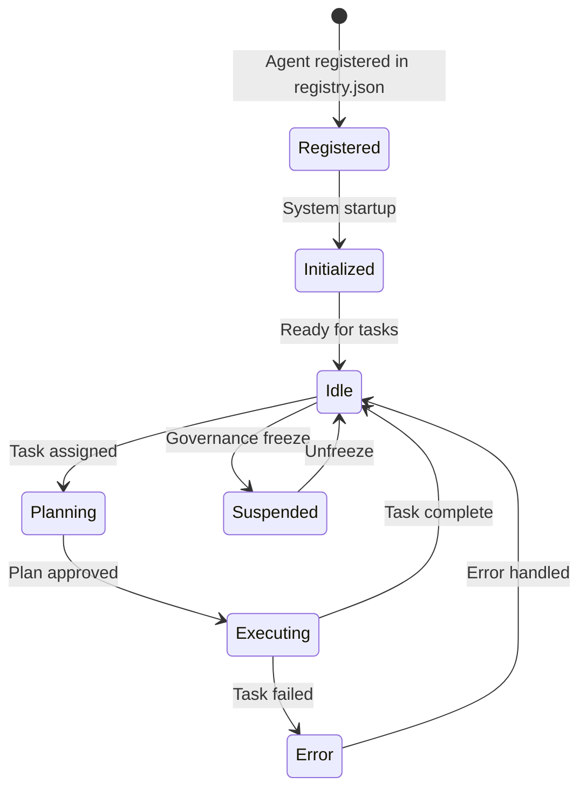

# Agent System Overview

SintraPrime implements a **multi-agent architecture** where specialized agents handle different domains of operation. All agents operate under the unified governance framework, share the receipt ledger, and communicate through structured protocols.

## Agent Registry

Agents are registered in `agents/registry.json`, which defines each agent's identity, capabilities, and permissions:

```json title="agents/registry.json"
{
  "agents": [
    {
      "id": "howard-trust-navigator",
      "type": "specialized",
      "domain": "trust-administration",
      "modules": 7,
      "permissions": ["gmail", "notion", "evidence", "finance"],
      "governance": "strict"
    },
    {
      "id": "sentinel-guard",
      "type": "monitor",
      "domain": "security-compliance",
      "permissions": ["read-all", "alert", "freeze"],
      "governance": "elevated"
    },
    {
      "id": "general-purpose-agent",
      "type": "general",
      "domain": "multi-purpose",
      "permissions": ["configurable"],
      "governance": "standard"
    },
    {
      "id": "content-production-agent",
      "type": "specialized",
      "domain": "content-creation",
      "permissions": ["clawdbot", "elevenlabs", "social-media"],
      "governance": "standard"
    }
  ]
}
```

## Agent Types

| Agent | Type | Domain | Key Capability |
|:---|:---|:---|:---|
| **Howard Trust Navigator** | Specialized | Trust Administration | 7-module trust management with credit enforcement |
| **SentinelGuard** | Monitor | Security & Compliance | Real-time monitoring, anomaly detection, freeze authority |
| **General Purpose Agent** | General | Multi-Purpose | Flexible task execution across all adapters |
| **Content Production Agent** | Specialized | Content Creation | Multi-platform content with AI and voice integration |

## Agent Lifecycle



## Inter-Agent Communication

Agents communicate through a structured message protocol:

```typescript
interface AgentMessage {
  from: string;        // Source agent ID
  to: string;          // Target agent ID
  type: 'request' | 'response' | 'alert' | 'delegate';
  payload: unknown;
  governance: {
    mode: GovernanceMode;
    receipt_ref: string;
  };
}
```

### Delegation

Agents can delegate tasks to other agents when the task falls outside their domain:

```
General Purpose Agent                Howard Trust Navigator
       │                                      │
       │  delegate: credit-check              │
       │─────────────────────────────────────▶│
       │                                      │
       │  response: credit-report             │
       │◀─────────────────────────────────────│
```

## Governance Integration

Every agent action passes through governance:

1. **Registration** — Agent capabilities are defined at registration time
2. **Task assignment** — Only agents with appropriate permissions receive tasks
3. **Execution** — Every adapter call is governed and receipted
4. **Monitoring** — SentinelGuard monitors all agent activity
5. **Audit** — Complete agent activity history in the receipt ledger

:::info Agent Registry Drift Detection
SintraPrime includes a CI check (`agent-registry-drift`) that detects unauthorized changes to the agent registry, ensuring that agent permissions cannot be modified without review.
:::

## Next Steps

- [Howard Trust Navigator](./howard-trust-navigator) — The trust administration agent
- [SentinelGuard](./sentinel-guard) — The security monitoring agent
- [General Purpose Agent](./general-purpose-agent) — The flexible task agent
- [Content Production Agent](./content-production-agent) — The content creation agent
