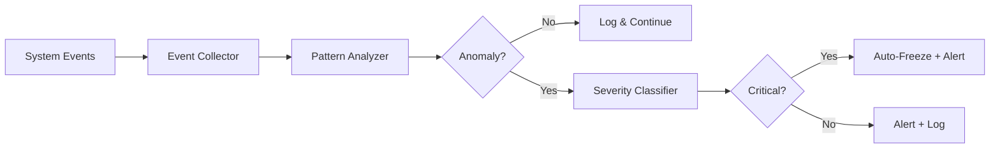

# SentinelGuard

**SentinelGuard** is SintraPrime's dedicated security and compliance monitoring agent. Unlike other agents that execute tasks, SentinelGuard's primary role is to **observe, analyze, and enforce** — monitoring all system activity in real-time and taking protective action when anomalies or violations are detected.

## Capabilities

| Capability | Description |
|:---|:---|
| **Real-time Monitoring** | Watches all agent operations, adapter calls, and governance events |
| **Anomaly Detection** | Identifies unusual patterns in system behavior |
| **Severity Classification** | Classifies events as critical, high, medium, or low severity |
| **Credit Monitoring** | Specialized monitoring for credit-related events |
| **Freeze Authority** | Can trigger FROZEN mode to preserve evidence |
| **Alert Generation** | Sends alerts via Slack, email, or webhook |
| **Audit Trail** | Maintains a complete monitoring audit trail |

## Monitoring Pipeline



## Severity Classification

SentinelGuard uses a multi-factor severity classification system:

```json title="tests/monitoring/fixtures/high-credit-spike.json"
{
  "event_type": "credit_spike",
  "severity": "high",
  "factors": {
    "score_change": -35,
    "new_inquiries": 2,
    "time_window": "24h"
  },
  "action": "escalate",
  "alert_channels": ["slack", "email"]
}
```

| Severity | Criteria | Auto-Action |
|:---|:---|:---|
| **Critical** | Score drop > 50, PII exposure, unauthorized access | Auto-freeze + immediate alert |
| **High** | Score drop > 25, suspicious patterns, policy violations | Escalate + alert |
| **Medium** | Score drop > 10, unusual activity | Log + alert |
| **Low** | Minor deviations, informational events | Log only |

## Monitoring Rules

SentinelGuard evaluates events against configurable monitoring rules:

```yaml title="config/sentinel-rules.yml"
rules:
  - name: high-spend-alert
    condition: "task.cost_usd > 50"
    severity: high
    action: alert
    channels: [slack, email]

  - name: pii-exposure
    condition: "output contains PII patterns"
    severity: critical
    action: freeze
    channels: [slack, email, webhook]

  - name: unusual-hours
    condition: "timestamp.hour < 6 OR timestamp.hour > 22"
    severity: medium
    action: log-and-alert
    channels: [slack]
```

## Integration with Receipt Ledger

SentinelGuard generates its own receipts for every monitoring action:

- **Observation receipts** — Records of what was monitored
- **Alert receipts** — Records of alerts sent
- **Freeze receipts** — Records of system freezes with justification
- **Classification receipts** — Records of severity classifications

This ensures that SentinelGuard's own actions are fully auditable.

## Freeze Authority

SentinelGuard is the only agent with the authority to trigger an automatic system freeze:

```typescript
// SentinelGuard freeze trigger
async function triggerFreeze(event: SecurityEvent): Promise<void> {
  // Generate freeze receipt
  const receipt = await generateReceipt({
    type: 'governance.freeze',
    reason: event.description,
    severity: event.severity,
    triggered_by: 'sentinel-guard',
    evidence: event.evidence_refs,
  });

  // Transition to FROZEN mode
  await setGovernanceMode('FROZEN');

  // Alert all channels
  await alertAllChannels({
    title: 'SYSTEM FROZEN',
    reason: event.description,
    receipt_id: receipt.receipt_id,
  });
}
```

:::danger Freeze Events
When SentinelGuard triggers a freeze, all system operations halt immediately. The freeze can only be lifted by a human operator, and the unfreeze event is permanently recorded. This mechanism is designed for evidence preservation during security incidents or legal proceedings.
:::

## Next Steps

- [Governance Model](../core-concepts/governance-model) — How governance modes work
- [Receipt Ledger](../core-concepts/receipt-ledger) — How monitoring receipts are stored
- [Howard Trust Navigator](./howard-trust-navigator) — The primary monitored agent
