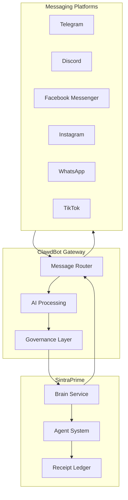

# Multi-Platform Bots Overview

SintraPrime integrates with **ClawdBot**, a self-hosted AI gateway that enables governed bot interactions across multiple messaging platforms. ClawdBot routes messages between platforms and SintraPrime's agent system, ensuring all bot interactions are receipted and governed.

## Architecture



## Supported Platforms

| Platform | Status | Features |
|:---|:---|:---|
| [**Telegram**](./telegram) | Production | Commands, inline queries, webhooks |
| [**Discord**](./discord) | Production | Slash commands, embeds, server management |
| [**Facebook**](./facebook-instagram) | Beta | Messenger, page management |
| [**Instagram**](./facebook-instagram) | Beta | DMs, content interaction |
| [**WhatsApp**](./whatsapp) | Beta | Business API, templates |
| [**TikTok**](./tiktok) | Alpha | Content publishing, analytics |

## Message Flow

1. **Inbound** — User sends a message on a platform
2. **Routing** — ClawdBot routes the message to SintraPrime
3. **Governance** — Message is checked against governance policies
4. **Processing** — Agent processes the message and generates a response
5. **Receipt** — A receipt is generated for the interaction
6. **Response** — Response is routed back through ClawdBot to the platform

## Governance

All bot interactions are governed:

- **Content filtering** — Outbound messages are checked against content policies
- **Rate limiting** — Per-platform and per-user rate limits
- **Audit trail** — Every message exchange generates a receipt
- **Platform compliance** — Responses comply with platform-specific rules

## Configuration

```bash title=".env"
CLAWDBOT_ENDPOINT=http://localhost:3200
CLAWDBOT_API_KEY=your-clawdbot-key

# Platform tokens
TELEGRAM_BOT_TOKEN=your-telegram-token
DISCORD_BOT_TOKEN=your-discord-token
META_ACCESS_TOKEN=your-meta-token
WHATSAPP_BUSINESS_TOKEN=your-whatsapp-token
```

## Next Steps

- [Telegram Bot](./telegram) — Telegram integration details
- [Discord Bot](./discord) — Discord integration details
- [Content Production Agent](../agents/content-production-agent) — Content for bot channels
