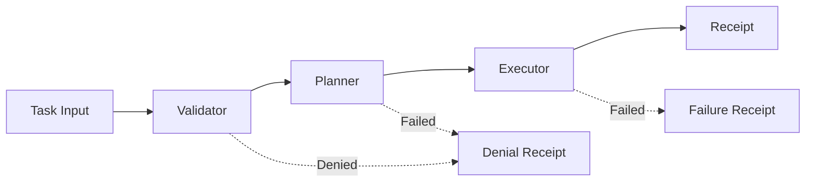

# Agent Mode Engine

The Agent Mode Engine is SintraPrime's core execution pipeline. Every task — whether submitted via CLI, webhook, or API — flows through the **Validator → Planner → Executor** pipeline, with governance enforcement and receipt generation at each stage.

## Pipeline Overview



## Stage 1: Validator

The Validator is the first gate. It checks:

- **Schema validation** — Is the task well-formed?
- **Governance mode** — Is the current mode compatible with this task?
- **Policy gates** — Do all applicable policy gates pass?
- **Spending limits** — Will this task exceed budget constraints?
- **Agent permissions** — Is the assigned agent authorized for this operation?

```typescript
interface ValidationResult {
  valid: boolean;
  errors: string[];
  warnings: string[];
  governance: {
    mode: GovernanceMode;
    gates_checked: string[];
    gates_passed: string[];
    approval_required: boolean;
  };
}
```

If validation fails, a **denial receipt** is generated and the task is rejected.

## Stage 2: Planner

The Planner generates an execution plan:

- **Step decomposition** — Break the task into atomic steps
- **Adapter selection** — Identify which adapters are needed
- **Dependency ordering** — Determine step execution order
- **Cost estimation** — Estimate the total cost of execution
- **Risk assessment** — Flag high-risk operations

```json title="Example Plan"
{
  "plan_id": "plan_x7y8z9",
  "task": "Send weekly report via email",
  "steps": [
    {
      "id": "step_1",
      "action": "generate_report",
      "adapter": "shell",
      "params": {"command": "npm run report:weekly"},
      "estimated_cost": 0.00
    },
    {
      "id": "step_2",
      "action": "send_email",
      "adapter": "gmail",
      "depends_on": ["step_1"],
      "params": {"to": "team@example.com", "subject": "Weekly Report"},
      "estimated_cost": 0.001
    }
  ],
  "total_estimated_cost": 0.001,
  "risk_level": "low",
  "approval_required": false
}
```

## Stage 3: Executor

The Executor runs the plan step by step:

- **Sequential execution** — Steps run in dependency order
- **Adapter invocation** — Each step calls its assigned adapter through the governance layer
- **Error handling** — Failures are caught, logged, and can trigger rollback
- **Progress tracking** — Real-time status updates for each step
- **Receipt generation** — A receipt is generated upon completion

## CLI Commands

The Agent Mode CLI provides direct access to the engine:

| Command | Description |
|:---|:---|
| `/run <task>` | Submit a task for full pipeline execution |
| `/plan <task>` | Generate a plan without executing it |
| `/status` | Show active tasks and system status |
| `/logs` | Display recent operation logs |
| `/config` | View current engine configuration |
| `/validate-batch <file>` | Validate multiple tasks from a JSON file |
| `/build-batch <file>` | Execute a batch of validated tasks |

### Example Usage

```bash
$ npx sintraprime agent

> /plan Analyze the latest web snapshots for policy changes
[Planner] Generating execution plan...
  Step 1: web-snapshot.list (adapter: snapshot)
  Step 2: web-snapshot.diff (adapter: snapshot)
  Step 3: analysis.generate (adapter: deepthink)
  Estimated cost: $0.05
  Risk level: low
  Approval required: no

> /run Analyze the latest web snapshots for policy changes
[Validator] ✓ Task validated
[Planner]   ✓ 3-step plan generated
[Executor]  → Step 1/3: Listing snapshots...
[Executor]  → Step 2/3: Computing diffs...
[Executor]  → Step 3/3: Generating analysis...
[Executor]  ✓ All steps completed
[Receipt]   ✓ rcpt_f8e7d6c5b4a3.json
```

## Error Handling

The engine implements a structured error handling strategy:

| Error Type | Behavior |
|:---|:---|
| Validation failure | Task rejected, denial receipt generated |
| Planning failure | Task rejected, failure receipt generated |
| Step failure (retryable) | Step retried up to 3 times |
| Step failure (fatal) | Remaining steps cancelled, failure receipt generated |
| Governance violation | Immediate halt, violation receipt generated |
| Timeout | Task cancelled, timeout receipt generated |

## Integration with Governance

The Agent Mode Engine is deeply integrated with the governance layer:

1. **Pre-execution** — Validator checks all governance constraints
2. **During execution** — Each adapter call passes through governance
3. **Post-execution** — Receipt is generated and chained
4. **On failure** — Failure receipts capture the full context

:::tip Batch Operations
For high-throughput scenarios, use batch operations (`/validate-batch` and `/build-batch`) to process multiple tasks efficiently while maintaining full governance compliance.
:::

## Next Steps

- [Workflow Runner](./workflow-runner) — Declarative workflow automation
- [Agent System Overview](../agents/overview) — The multi-agent architecture
- [Receipt Ledger](./receipt-ledger) — How receipts work
