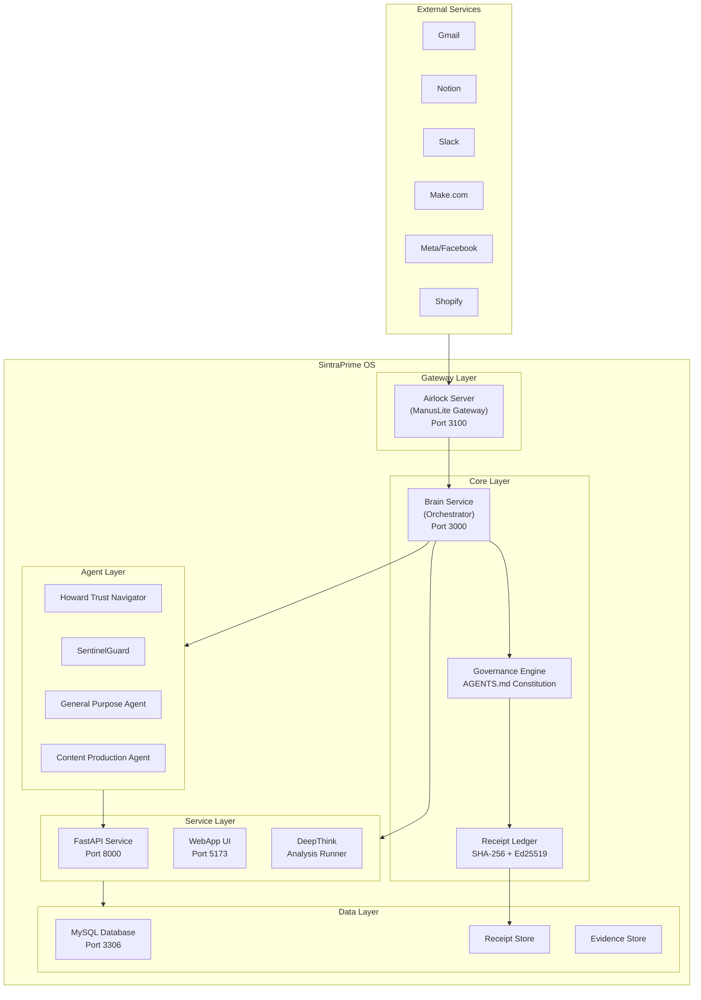

# Architecture Overview

SintraPrime is built as a **multi-service architecture** where every component operates under a unified governance layer. This design ensures that no AI agent action can bypass policy enforcement, receipt generation, or audit logging.

## System Architecture



## Service Architecture

SintraPrime consists of five primary services, each containerized for production deployment:

### Airlock Server (ManusLite Gateway)

The Airlock is the **single entry point** for all external payloads entering SintraPrime. It provides:

- **HMAC verification** — Every incoming request is verified against a shared secret
- **Rate limiting** — Configurable per-IP request throttling
- **Payload validation** — Schema validation before forwarding to the Brain
- **Security hardening** — Helmet headers, CORS controls, and request sanitization

### Brain Service (Core Orchestrator)

The Brain is the heart of SintraPrime. It contains:

- **Agent Mode Engine** — The Validator → Planner → Executor pipeline
- **Workflow Runner** — YAML/JSON workflow execution engine
- **Governance Engine** — Policy gates, mode enforcement, and approval workflows
- **Adapter Manager** — Governed access to all external services
- **Receipt Generator** — Cryptographic receipt creation and chain management

### FastAPI Service

The Python-based FastAPI service handles:

- **ML/AI model integrations** — Advanced reasoning and analysis
- **DeepThink analysis** — Deterministic analysis with cryptographic verification
- **Data processing** — Complex data transformations and aggregations

### WebApp (Operator Dashboard)

The web application provides:

- **System monitoring** — Real-time service health and metrics
- **Receipt browser** — Search and verify operation receipts
- **Task management** — Submit, monitor, and approve tasks
- **Evidence viewer** — Browse and export evidence artifacts

### MySQL Database

Persistent storage for:

- **Receipt ledger** — Immutable operation records
- **Evidence artifacts** — Processed evidence with metadata
- **System state** — Configuration, agent registry, and task queues
- **Audit logs** — Comprehensive system activity logs

## Request Flow

Every operation in SintraPrime follows this flow:

1. **Ingress** — External request arrives at the Airlock Server
2. **Verification** — HMAC signature is verified, payload is validated
3. **Governance Check** — The governance engine checks mode, policy gates, and spending limits
4. **Planning** — The Planner generates an execution plan with required adapters
5. **Approval** — If required, the task awaits human approval
6. **Execution** — The Executor runs the plan through governed adapters
7. **Receipt Generation** — A cryptographic receipt is generated with SHA-256 hash and Ed25519 signature
8. **Chain Update** — The receipt is chained to the previous receipt via hash linking
9. **Response** — Results are returned to the caller with receipt reference

## Governance Wrapping

The critical architectural principle is that **governance wraps everything**. There is no code path that bypasses the governance layer:

```
┌─────────────────────────────────────────┐
│           Governance Layer              │
│  ┌───────────────────────────────────┐  │
│  │        Policy Gates               │  │
│  │  ┌─────────────────────────────┐  │  │
│  │  │     Mode Enforcement        │  │  │
│  │  │  ┌───────────────────────┐  │  │  │
│  │  │  │   Agent Execution     │  │  │  │
│  │  │  │  ┌─────────────────┐  │  │  │  │
│  │  │  │  │ Adapter Action  │  │  │  │  │
│  │  │  │  └─────────────────┘  │  │  │  │
│  │  │  └───────────────────────┘  │  │  │
│  │  └─────────────────────────────┘  │  │
│  └───────────────────────────────────┘  │
│           Receipt Generation            │
└─────────────────────────────────────────┘
```

:::info Design Philosophy
SintraPrime follows a **fail-closed** design. If any governance check fails — missing policy, invalid mode, exceeded spending limit — the operation is rejected and a denial receipt is generated. The system never defaults to allowing an operation.
:::

## Technology Stack

| Layer | Technology |
|:---|:---|
| **Language** | TypeScript (86.6%), JavaScript (7.7%) |
| **Runtime** | Node.js 20+ |
| **Framework** | Express.js (Airlock), Custom (Brain) |
| **Database** | MySQL 8.0 |
| **Browser Automation** | Playwright |
| **Containerization** | Docker, Docker Compose |
| **AI Providers** | OpenAI, Anthropic, Kimi K 2.5, ClawdBot |
| **Cryptography** | SHA-256 (hashing), Ed25519 (signing) |

## Next Steps

- [Governance Model](./governance-model) — Deep dive into fail-closed governance
- [Receipt Ledger](./receipt-ledger) — How cryptographic receipts work
- [Agent Mode Engine](./agent-mode-engine) — The execution pipeline
