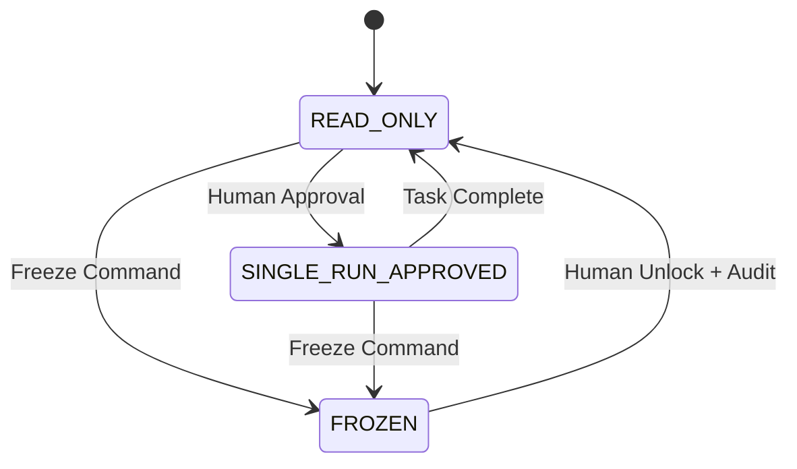

# Governance Model

SintraPrime's governance model is the foundational layer that distinguishes it from conventional AI agent frameworks. Every operation — from sending an email to executing a shell command — passes through a multi-layer governance stack that enforces authorization, generates audit trails, and ensures court-ready compliance.

## Core Philosophy: Fail-Closed

SintraPrime operates on a **fail-closed** principle:

> If any governance check fails, the operation is **denied by default**. The system never assumes an operation is safe. Every action must be explicitly authorized.

This is the opposite of most AI frameworks, which operate fail-open (allow unless explicitly denied). SintraPrime's approach ensures that:

- No unauthorized operations can execute
- Every denial is logged with a receipt
- The system is safe even when misconfigured

## AGENTS.md Constitution

The `AGENTS.md` file serves as the **constitutional document** for all AI agents operating within SintraPrime. It defines:

- **Agent boundaries** — What each agent type is permitted to do
- **Forbidden actions** — Explicitly prohibited operations
- **Escalation procedures** — When and how to escalate to human operators
- **Inter-agent protocols** — How agents communicate and delegate

```markdown title="AGENTS.md (excerpt)"
# SintraPrime Agent Constitution

## Article 1: Fundamental Principles
1.1 All agent actions MUST generate a cryptographic receipt
1.2 No agent may bypass policy gates under any circumstances
1.3 Fail-closed: deny by default, allow only with explicit authorization

## Article 2: Mode Governance
2.1 Agents MUST respect the current governance mode
2.2 Mode transitions require human approval
2.3 FROZEN mode cannot be exited programmatically
```

## Mode Governance

SintraPrime supports three governance modes that control what operations are permitted:

| Mode | Description | Permitted Actions |
|:---|:---|:---|
| **READ_ONLY** | Observation only | Read operations, monitoring, analysis |
| **SINGLE_RUN_APPROVED** | One-shot execution | Single approved task execution, then return to READ_ONLY |
| **FROZEN** | Evidence preservation | No operations permitted; system is locked for forensic review |

### Mode Transitions



:::danger FROZEN Mode
Once a system enters `FROZEN` mode, it cannot be unfrozen programmatically. A human operator must explicitly unlock the system, and the unlock event is permanently recorded in the receipt ledger. This mode is designed for evidence preservation during legal proceedings.
:::

## Policy Gates

Policy gates are configurable rules that control specific aspects of agent behavior:

### Spending Controls

```json title="config/policy-gates.json"
{
  "spending": {
    "max_per_task": 10.00,
    "max_per_day": 100.00,
    "max_per_month": 1000.00,
    "currency": "USD",
    "require_approval_above": 5.00
  }
}
```

### Approval Workflows

Certain operations require explicit human approval before execution:

| Operation Type | Approval Required | Approver |
|:---|:---|:---|
| Email sending | Yes (configurable) | Operator |
| Financial transactions | Always | Owner |
| Data deletion | Always | Owner |
| Mode transitions | Always | Owner |
| External API calls | Configurable | Operator |

### Domain Restrictions

```json
{
  "browser": {
    "domain_allowlist": ["*.example.com", "github.com"],
    "domain_blocklist": ["*.malware.com"]
  },
  "shell": {
    "command_allowlist": ["echo", "cat", "ls", "grep"],
    "command_blocklist": ["rm -rf", "dd", "mkfs"]
  }
}
```

## Governance Enforcement

Governance is enforced at multiple layers:

1. **Airlock Layer** — HMAC verification, rate limiting, payload validation
2. **Brain Layer** — Mode checking, policy gate evaluation, spending limit enforcement
3. **Agent Layer** — Agent-specific constraints from AGENTS.md
4. **Adapter Layer** — Adapter-specific allowlists and security controls
5. **Receipt Layer** — Every operation (approved or denied) generates a receipt

### Enforcement Flow

```typescript
// Simplified governance check flow
async function enforceGovernance(task: Task): Promise<GovernanceResult> {
  // 1. Check current mode
  if (currentMode === 'FROZEN') {
    return deny('System is in FROZEN mode');
  }

  // 2. Check policy gates
  const policyResult = await checkPolicyGates(task);
  if (!policyResult.allowed) {
    return deny(policyResult.reason);
  }

  // 3. Check spending limits
  const spendResult = await checkSpendingLimits(task);
  if (!spendResult.allowed) {
    return deny(spendResult.reason);
  }

  // 4. Check agent permissions
  const agentResult = await checkAgentPermissions(task.agent, task.action);
  if (!agentResult.allowed) {
    return deny(agentResult.reason);
  }

  // 5. Generate approval request if needed
  if (requiresApproval(task)) {
    return awaitApproval(task);
  }

  return allow();
}
```

## Audit and Compliance

Every governance decision is recorded:

- **Approvals** generate a receipt with the approver's identity and timestamp
- **Denials** generate a receipt with the denial reason and policy reference
- **Mode transitions** generate a receipt with before/after states
- **Policy changes** generate a receipt with the diff and authorizer

This creates a complete, immutable audit trail that satisfies regulatory and legal requirements.

## Next Steps

- [Immutable Receipt Ledger](./receipt-ledger) — How receipts are generated and verified
- [Agent Mode Engine](./agent-mode-engine) — How governance integrates with execution
- [SentinelGuard](../agents/sentinel-guard) — The compliance monitoring agent
