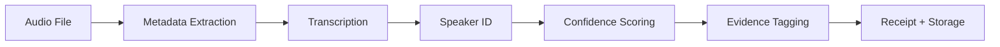

# Call Ingest

The Call/Audio Ingest system processes call recordings and audio files into structured evidence with transcriptions, speaker identification, confidence scoring, and complete chain of custody documentation.

## Pipeline



## Processing Steps

### 1. Audio Ingestion

Audio files are ingested with metadata extraction:

```json
{
  "call_id": "call_a1b2c3",
  "source_file": "recording_20260220.mp3",
  "format": "mp3",
  "duration_seconds": 1847,
  "sample_rate": 44100,
  "channels": 2,
  "file_hash": "sha256:a3f2b1c4..."
}
```

### 2. Transcription

Audio is transcribed with per-segment confidence scores:

```json
{
  "transcript_id": "tx_d4e5f6",
  "segments": [
    {
      "start": 0.0,
      "end": 4.5,
      "speaker": "Speaker_A",
      "text": "Good morning, this is the weekly trust review.",
      "confidence": 0.96
    },
    {
      "start": 4.8,
      "end": 9.2,
      "speaker": "Speaker_B",
      "text": "Thank you. Let's start with the credit monitoring update.",
      "confidence": 0.94
    }
  ],
  "overall_confidence": 0.95
}
```

### 3. Speaker Identification

Speakers are identified and labeled:

| Feature | Description |
|:---|:---|
| **Speaker diarization** | Automatic speaker segmentation |
| **Speaker labeling** | Map speaker IDs to known identities |
| **Speaker statistics** | Talk time, interruptions, turn-taking |

### 4. Evidence Tagging

Transcripts are automatically tagged with evidence markers:

- **Key topics** — Automated topic extraction
- **Action items** — Identified commitments and follow-ups
- **Legal references** — Detected legal terms and citations
- **Dates and deadlines** — Extracted temporal references

## Usage

```bash
# Ingest a call recording
npx sintraprime evidence call ingest /path/to/recording.mp3

# Ingest with speaker mapping
npx sintraprime evidence call ingest /path/to/recording.mp3 \
  --speakers '{"Speaker_A": "John Smith", "Speaker_B": "Jane Doe"}'

# View transcripts
npx sintraprime evidence call list --limit 10

# Export transcript
npx sintraprime evidence call export call_a1b2c3 --format pdf
```

## Governance

- All audio processing generates receipts
- Original audio files are preserved with content hashes
- Transcripts are signed and chained
- Speaker identification mappings are auditable

:::info Transcription Accuracy
Transcription confidence scores help assess reliability. Segments with confidence below 0.80 are flagged for human review. Always verify critical evidence transcriptions manually.
:::

## Next Steps

- [Timeline Builder](./timeline-builder) — Integrate call events into timelines
- [Narrative Generator](./narrative-generator) — Generate narratives from transcripts
- [Voice & Transcription](../adapters/voice-transcription) — Voice adapter details
