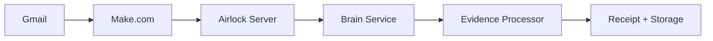

# Email Ingest

The Email Ingest Server processes incoming emails through a governed pipeline that transforms email correspondence into verified evidence with complete chain of custody documentation.

## Pipeline Architecture



## Pipeline Stages

### 1. Gmail Trigger

Gmail filters route matching emails to a Make.com scenario:

- Configurable label-based filtering
- Sender/recipient matching
- Subject line pattern matching
- Attachment type filtering

### 2. Make.com Processing

Make.com extracts structured data from the email:

```json
{
  "from": "sender@example.com",
  "to": "recipient@example.com",
  "subject": "Re: Trust Account Statement",
  "date": "2026-02-20T10:30:00Z",
  "body_text": "...",
  "body_html": "...",
  "attachments": [
    {"name": "statement.pdf", "size": 245000, "mime": "application/pdf"}
  ],
  "headers": {"message-id": "<abc123@mail.example.com>"}
}
```

### 3. Airlock Verification

The Airlock Server verifies the incoming payload:

- HMAC signature verification
- Schema validation
- Rate limit checking

### 4. Evidence Processing

The Brain Service processes the email as evidence:

- **Content hashing** — SHA-256 hash of email body and each attachment
- **Metadata extraction** — Structured metadata from headers
- **Evidence tagging** — Automated classification and tagging
- **Receipt generation** — Immutable receipt for the ingest operation

### 5. Storage

Processed evidence is stored with full chain of custody:

- Email content and metadata in the database
- Attachments stored with content hashes
- Receipt linked to the evidence record
- Chain of custody initialized

## Configuration

```bash title=".env"
GMAIL_INGEST_ENABLED=true
GMAIL_INGEST_LABELS=evidence,legal,trust
MAKE_WEBHOOK_URL=https://hook.make.com/your-webhook-id
EVIDENCE_STORAGE_PATH=./evidence/email
```

## Usage

```bash
# Check ingest pipeline status
npx sintraprime evidence email status

# Manually trigger email ingest
npx sintraprime evidence email ingest --label evidence --since 7d

# View ingested emails
npx sintraprime evidence email list --limit 20
```

:::tip Make.com Integration
The email ingest pipeline uses Make.com as a middleware layer for reliable email processing. See the [Deployment Guide](../deployment/overview) for setup instructions.
:::

## Next Steps

- [Web Snapshots](./web-snapshots) — Web evidence capture
- [Evidence Lifecycle](./lifecycle) — Complete evidence flow
- [Gmail Adapter](../adapters/gmail) — Gmail adapter configuration
