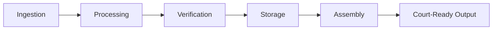

# Evidence Lifecycle

SintraPrime implements a complete **evidence lifecycle chain** that transforms raw data from multiple sources into court-ready documentation. Every piece of evidence is cryptographically verified, timestamped, and chained to maintain an unbreakable chain of custody.

## Lifecycle Stages



### 1. Ingestion

Evidence enters SintraPrime through multiple channels:

| Source | Adapter | Evidence Type |
|:---|:---|:---|
| Email | Gmail Adapter | Correspondence, attachments |
| Web pages | Browser Operator | Screenshots, PDFs, content |
| Phone calls | Voice Adapter | Recordings, transcripts |
| Documents | Notion Adapter | Structured data, notes |
| System events | Receipt Ledger | Operation records |

### 2. Processing

Raw evidence is processed into structured formats:

- **Metadata extraction** — Timestamps, authors, recipients, subjects
- **Content parsing** — Text extraction, OCR, transcription
- **Classification** — Evidence type, relevance, sensitivity
- **Tagging** — Automated and manual evidence tags

### 3. Verification

Every piece of evidence is cryptographically verified:

- **SHA-256 hashing** — Content hash for integrity verification
- **Ed25519 signing** — Digital signature for authenticity
- **Timestamp certification** — Provable timestamp for when evidence was captured
- **Chain linking** — Each evidence item links to its receipt

### 4. Storage

Verified evidence is stored with full metadata:

```json
{
  "evidence_id": "ev_a1b2c3d4",
  "type": "email",
  "source": "gmail-ingest",
  "captured_at": "2026-02-20T15:30:00.000Z",
  "content_hash": "sha256:a3f2b1c4...",
  "signature": "ed25519:base64...",
  "receipt_id": "rcpt_e5f6g7h8",
  "tags": ["trust-administration", "credit-dispute"],
  "chain_of_custody": [
    {"action": "ingested", "timestamp": "2026-02-20T15:30:00Z", "actor": "gmail-adapter"},
    {"action": "processed", "timestamp": "2026-02-20T15:30:05Z", "actor": "evidence-processor"},
    {"action": "verified", "timestamp": "2026-02-20T15:30:06Z", "actor": "verification-engine"}
  ]
}
```

### 5. Assembly

Evidence is assembled into court-ready outputs:

- **Timeline Builder** — Chronological event assembly
- **Narrative Generator** — Automated narrative creation
- **Binder Assembly** — PDF compilation for legal proceedings

### 6. Court-Ready Output

Final outputs meet legal admissibility standards:

- Complete chain of custody documentation
- Cryptographic verification certificates
- Chronological timelines with source references
- Professional narrative summaries
- Compiled binder PDFs with table of contents

## Chain of Custody

Every evidence item maintains a complete chain of custody record:

```
Captured → Processed → Verified → Stored → Retrieved → Assembled → Exported
    ↓          ↓           ↓         ↓          ↓           ↓          ↓
 Receipt    Receipt     Receipt   Receipt    Receipt     Receipt    Receipt
```

:::info Court Readiness
SintraPrime's evidence systems are designed to produce documentation that meets the standards for court admissibility. However, legal requirements vary by jurisdiction. Always consult with legal counsel regarding evidence handling requirements for your specific use case.
:::

## Next Steps

- [Email Ingest](./email-ingest) — Email evidence pipeline
- [Web Snapshots](./web-snapshots) — Web evidence capture
- [Timeline Builder](./timeline-builder) — Chronological assembly
- [Narrative Generator](./narrative-generator) — Court-ready narrative and binder assembly
