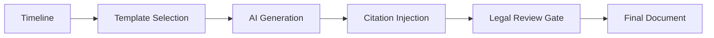

# Narrative Generator

The Narrative Generator transforms evidence timelines into professional, legal-grade narrative documents. It uses AI-powered text generation combined with structured templates to produce documentation suitable for legal proceedings, compliance reports, and administrative records.

## Capabilities

| Feature | Description |
|:---|:---|
| **Automated narratives** | Generate narratives from timeline events |
| **Template system** | Pre-built templates for common document types |
| **Legal formatting** | Output formatted for legal proceedings |
| **Citation management** | Automatic evidence citations and references |
| **Multi-format export** | PDF, DOCX, Markdown output |

## Narrative Pipeline



## Template Types

| Template | Use Case |
|:---|:---|
| `dispute-narrative` | Credit dispute documentation |
| `compliance-report` | Regulatory compliance summaries |
| `incident-report` | Security incident documentation |
| `escalation-summary` | Escalation history documentation |
| `weekly-summary` | Weekly operational summaries |

## Usage

```bash
# Generate a narrative from a timeline
npx sintraprime evidence narrative generate \
  --timeline timeline_a1b2c3 \
  --template dispute-narrative

# Generate with custom parameters
npx sintraprime evidence narrative generate \
  --timeline timeline_a1b2c3 \
  --template compliance-report \
  --format pdf \
  --output /reports/compliance-feb-2026.pdf

# List available templates
npx sintraprime evidence narrative templates
```

## Example Output

```markdown
# Credit Dispute Narrative — Case #12345

## Summary

On February 1, 2026, a credit dispute was filed regarding unauthorized
inquiries on the trust account. This narrative documents the complete
sequence of events from initial filing through resolution.

## Timeline of Events

1. **February 1, 2026** — Dispute filed via email to Equifax
   [Evidence: ev_a1b2c3, Receipt: rcpt_d4e5f6]

2. **February 5, 2026** — Acknowledgment received from Equifax
   [Evidence: ev_g7h8i9, Receipt: rcpt_j0k1l2]

3. **February 10, 2026** — Equifax privacy policy updated
   [Evidence: ev_m3n4o5, Receipt: rcpt_p6q7r8]
   Note: Web snapshot diff detected changes to data retention period.

...

## Verification

All evidence items referenced in this narrative have been cryptographically
verified. SHA-256 hashes and Ed25519 signatures are intact as of the
generation date.

Generated: 2026-02-20T15:30:00Z
Receipt: rcpt_s9t0u1
```

## Binder Assembly

Narratives can be compiled into court-ready binders:

```bash
# Assemble a binder
npx sintraprime evidence binder assemble \
  --narrative narrative_a1b2c3 \
  --include-evidence \
  --include-receipts \
  --include-timeline \
  --output /binders/case-12345.pdf
```

The binder includes:

- **Cover page** — Case identification and summary
- **Table of contents** — Auto-generated from content
- **Narrative document** — The generated narrative
- **Evidence exhibits** — Referenced evidence items
- **Timeline visualization** — Chronological event display
- **Receipt verification** — Cryptographic verification certificates
- **Chain of custody log** — Complete handling documentation

## Governance

- Narrative generation is governed and receipted
- AI-generated content is flagged for human review
- All citations are verified against the evidence store
- Binder assembly generates a comprehensive receipt

:::warning Legal Review
AI-generated narratives should always be reviewed by qualified legal counsel before use in legal proceedings. The Narrative Generator produces draft documents that require human verification.
:::

## Next Steps

- [Timeline Builder](./timeline-builder) — Source data for narratives
- [Evidence Lifecycle](./lifecycle) — Complete evidence flow
- [Howard Trust Navigator](../agents/howard-trust-navigator) — Trust-specific evidence workflows
