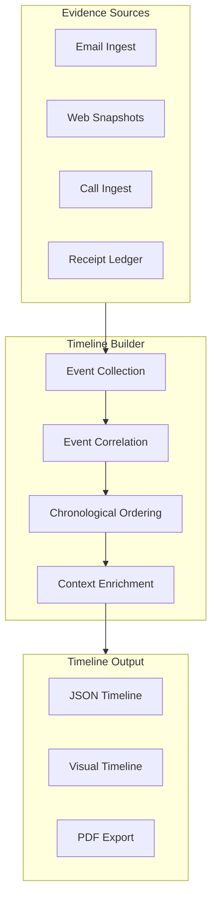

# Timeline Builder

The Timeline Builder assembles events from multiple evidence sources into a unified, chronological timeline. It correlates events across emails, web snapshots, call recordings, and system operations to create a comprehensive narrative of what happened and when.

## Architecture



## Event Structure

Each timeline event contains:

```json
{
  "event_id": "evt_a1b2c3",
  "timestamp": "2026-02-20T15:30:00Z",
  "type": "email_received",
  "source": "gmail-ingest",
  "evidence_id": "ev_d4e5f6",
  "summary": "Credit bureau response received regarding dispute #12345",
  "participants": ["credit-bureau@example.com", "trust@example.com"],
  "tags": ["credit-dispute", "bureau-response"],
  "related_events": ["evt_x7y8z9", "evt_m3n4o5"],
  "receipt_id": "rcpt_g7h8i9"
}
```

## Event Correlation

The Timeline Builder automatically correlates events across sources:

| Correlation Method | Description |
|:---|:---|
| **Temporal proximity** | Events within a configurable time window |
| **Participant matching** | Events involving the same people or entities |
| **Reference matching** | Events referencing the same case, dispute, or document |
| **Tag matching** | Events sharing the same evidence tags |
| **Thread tracking** | Email threads, call follow-ups |

## Usage

```bash
# Build a timeline from all evidence
npx sintraprime evidence timeline build --since 30d

# Build a timeline for a specific case
npx sintraprime evidence timeline build --tags credit-dispute-12345

# Build a timeline from specific sources
npx sintraprime evidence timeline build \
  --sources email,web-snapshot,call \
  --since 90d

# Export timeline
npx sintraprime evidence timeline export timeline_a1b2c3 --format pdf
```

## Visual Timeline

The Timeline Builder can generate visual timelines for presentations and reports:

```
2026-02-01  ●─── Credit dispute filed (email)
            │
2026-02-05  ●─── Bureau acknowledgment received (email)
            │
2026-02-10  ●─── Policy page updated (web snapshot)
            │
2026-02-15  ●─── Follow-up call with bureau (call recording)
            │
2026-02-20  ●─── Resolution received (email)
```

## Escalation Documentation

The Timeline Builder automatically generates escalation documentation when events indicate escalating severity:

- **Missed deadlines** — Flagged when expected responses are overdue
- **Severity increases** — Tracked when event severity escalates
- **Pattern detection** — Identified when events form concerning patterns

:::tip Timeline Best Practices
- Use consistent evidence tags across all sources for accurate correlation
- Review automated correlations for accuracy before using in legal proceedings
- Export timelines in PDF format for court submissions
:::

## Next Steps

- [Narrative Generator](./narrative-generator) — Generate narratives from timelines
- [Evidence Lifecycle](./lifecycle) — Complete evidence flow
