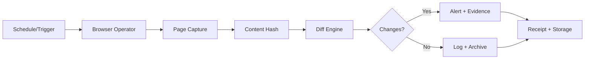

# Web Snapshots

The Web Snapshot and Watch system captures evidence-grade web page snapshots with diff detection, enabling automated monitoring of policy changes, terms of service updates, and other web-based evidence collection.

## Capabilities

| Feature | Description |
|:---|:---|
| **Full-page capture** | Screenshot and PDF capture of entire web pages |
| **Diff detection** | Automatic comparison between captures to detect changes |
| **Policy monitoring** | Scheduled monitoring of policy and terms pages |
| **Content hashing** | SHA-256 hash of captured content for integrity |
| **Metadata recording** | URL, timestamp, viewport, HTTP headers |
| **Receipt generation** | Every capture generates an immutable receipt |

## Architecture



## Capture Types

### Screenshot Capture

Full-page screenshots with evidence metadata:

```typescript
const result = await snapshotAdapter.execute({
  type: 'capture',
  params: {
    url: 'https://example.com/terms-of-service',
    format: 'screenshot',
    viewport: { width: 1920, height: 1080 },
    fullPage: true,
  },
});
```

### PDF Capture

Printable PDF versions of web pages:

```typescript
const result = await snapshotAdapter.execute({
  type: 'capture',
  params: {
    url: 'https://example.com/privacy-policy',
    format: 'pdf',
    includeHeaders: true,
  },
});
```

### Content Capture

Raw HTML and text content for diff analysis:

```typescript
const result = await snapshotAdapter.execute({
  type: 'capture',
  params: {
    url: 'https://example.com/policy',
    format: 'content',
    selectors: ['.policy-body', '.last-updated'],
  },
});
```

## Diff Detection

The diff engine compares captures over time to detect changes:

```json
{
  "diff_id": "diff_a1b2c3",
  "url": "https://example.com/terms",
  "previous_capture": "snap_x7y8z9",
  "current_capture": "snap_a1b2c3",
  "changes_detected": true,
  "diff_summary": {
    "additions": 15,
    "deletions": 3,
    "modifications": 7
  },
  "significant_changes": [
    {
      "section": "Data Retention",
      "type": "modification",
      "before": "Data retained for 12 months",
      "after": "Data retained for 36 months"
    }
  ]
}
```

## Scheduled Monitoring

Configure automated monitoring with watch rules:

```yaml title="config/web-watch.yml"
watches:
  - name: terms-of-service
    url: https://example.com/terms
    schedule: "0 */6 * * *"  # Every 6 hours
    format: [screenshot, pdf, content]
    diff: true
    alert_on_change: true
    alert_channels: [slack, email]

  - name: privacy-policy
    url: https://example.com/privacy
    schedule: "0 9 * * *"  # Daily at 9 AM
    format: [content]
    diff: true
    alert_on_change: true
```

## Evidence Value

Web snapshots serve as legal evidence by providing:

- **Timestamped captures** — Proof of what a web page showed at a specific time
- **Content integrity** — SHA-256 hash proves the capture has not been modified
- **Chain of custody** — Complete record from capture to storage
- **Diff history** — Documented history of changes over time

:::info Legal Admissibility
Web snapshots with cryptographic verification and chain of custody documentation are increasingly accepted as evidence in legal proceedings. The combination of timestamps, content hashes, and digital signatures provides strong evidence of authenticity.
:::

## Next Steps

- [Call Ingest](./call-ingest) — Audio evidence processing
- [Timeline Builder](./timeline-builder) — Assemble snapshots into timelines
- [Browser Operator](../adapters/browser) — Underlying browser automation
