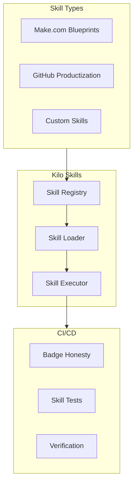

# Kilo Skills System

The **Kilo Skills System** is SintraPrime's extensible framework for packaging, distributing, and executing reusable automation capabilities. Each "skill" is a self-contained unit of functionality that can be composed into workflows, shared across deployments, and verified through CI pipelines.

## Architecture



## Skill Types

### Make.com Blueprint Skills

Automated generation of Make.com scenarios from SintraPrime workflow definitions:

```bash
# Generate a Make.com blueprint from a workflow
npx sintraprime kilo make-blueprint \
  --workflow workflows/evidence-collection.yml \
  --output blueprints/evidence-collection.json
```

### GitHub Productization Skills

Package SintraPrime features as standalone GitHub repositories:

```bash
# Productize a feature as a GitHub package
npx sintraprime kilo productize \
  --feature evidence-timeline \
  --repo ihoward40/sintraprime-timeline \
  --license Apache-2.0
```

### Custom Skills

User-defined skills that extend SintraPrime's capabilities:

```typescript title="skills/custom/my-skill.ts"
import { Skill, SkillContext, SkillResult } from '@sintraprime/skills';

export default class MySkill implements Skill {
  id = 'my-custom-skill';
  version = '1.0.0';
  description = 'A custom skill for specialized processing';

  async execute(context: SkillContext): Promise<SkillResult> {
    // Skill implementation
    const result = await context.adapters.shell.exec('echo "Hello from skill"');
    return { success: true, data: result };
  }
}
```

## Skill Registry

Skills are registered in `src/skills/registry.json`:

```json
{
  "skills": [
    {
      "id": "make-blueprint-generator",
      "type": "make",
      "version": "1.0.0",
      "status": "production"
    },
    {
      "id": "github-productizer",
      "type": "github",
      "version": "1.0.0",
      "status": "production"
    }
  ]
}
```

## CI Badge Honesty

The Kilo Skills system includes a **CI Badge Honesty** enforcement mechanism that ensures CI/CD badges in README files accurately reflect the current build status:

```bash
# Verify badge honesty
npx sintraprime kilo verify-badges

# Update badges to reflect current status
npx sintraprime kilo update-badges
```

This prevents "badge fraud" where projects display passing badges despite failing tests.

## Usage

```bash
# List available skills
npx sintraprime kilo list

# Execute a skill
npx sintraprime kilo run make-blueprint-generator \
  --input workflows/my-workflow.yml

# Install a skill from the registry
npx sintraprime kilo install community-skill-name

# Verify all skills
npx sintraprime kilo verify
```

## Governance

All skill operations are governed:

- Skill installation requires approval
- Skill execution generates receipts
- Custom skills are sandboxed
- CI verification ensures skill integrity

:::tip Extending SintraPrime
The Kilo Skills system is the recommended way to extend SintraPrime's capabilities. Rather than modifying core code, create a skill that integrates through the standard skill interface.
:::

## Next Steps

- [Workflow Runner](../core-concepts/workflow-runner) — Use skills in workflows
- [Contributing Guide](../contributing/guide) — Create and share skills
- [Deployment Guide](../deployment/overview) — Deploy with custom skills
